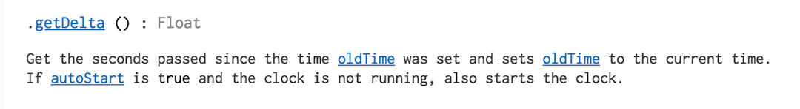
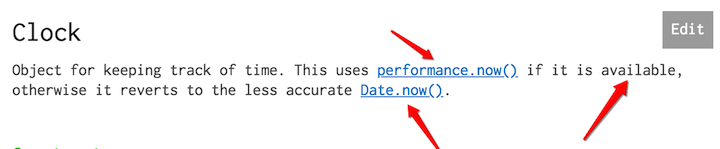
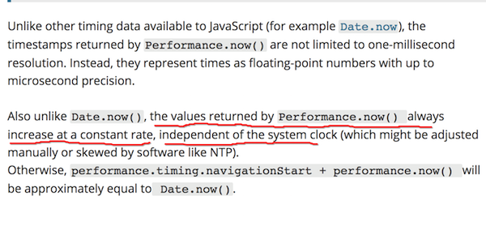
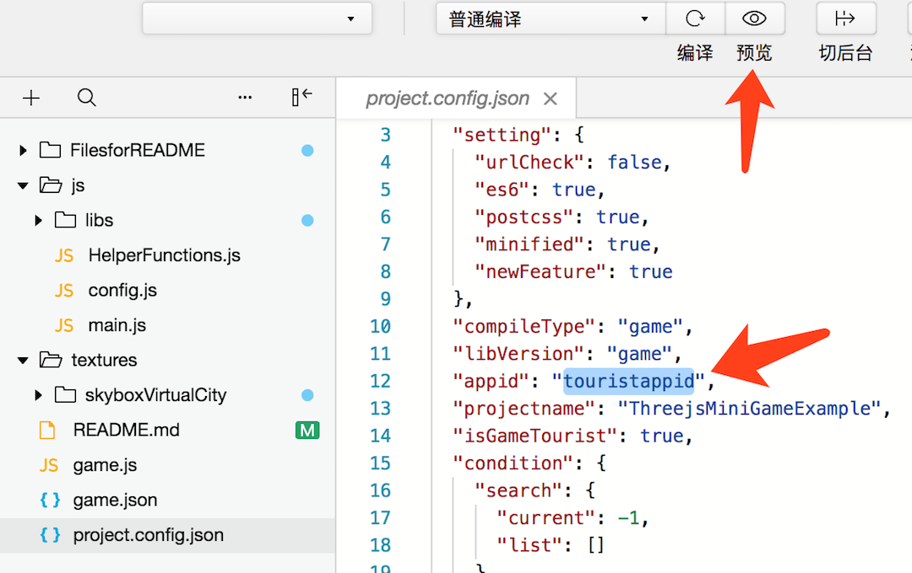
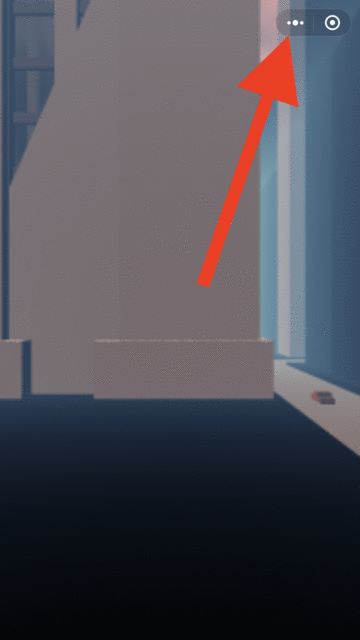
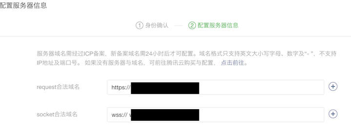

# Register
Go to: https://mp.weixin.qq.com/wxopen/waregister?action=step1 to register

Tips:

1. Do not use your qq email address, if your wechat account has binded to that qq account... (Otherwise you cannot get a notion on this email address has been used, nor receive a validation email)
2. Select the mini-game category instead of mini-programme
3. If you are not about to publish it, you can skip this registering step. You can develop your mini-game ahead by using tourist-app-id.

# How to Create an Empty ThreeJS Wechat Mini-Game Project
You can follow this 1'37'' video:

[](https://youtu.be/FZxf3Z_QUeg)

# About weapp-adapter
I'm using this 3rd party weapp-adapter: https://github.com/finscn/weapp-adapter

Then, adding following lines in index.js:

```javascript
window.performance.now = function(){
    return Date.now();
};
```

Reasons: (It can be fixed by the official team while you're reading this article.)
According to the threejs docs on [Clock](https://threejs.org/docs/#api/core/Clock):



I should get the period in seconds, but I got in milliseconds in the mini-game.

Refs:


# Adding ThreeJS and OrbitControlsJS
three.min.js:

https://raw.githubusercontent.com/mrdoob/three.js/dev/build/three.min.js

OrbitControls.js:

https://raw.githubusercontent.com/mrdoob/three.js/dev/examples/js/controls/OrbitControls.js

Adding following lines at the beginning of OrbitControls.js:

```javascript
var THREE = require('three.min');
```

So do other ThreeJS 3D model Loaders.

# What else in the example code:
1. How to add the wechat loading wiget with threejs loading manager;
2. How to add skybox to the scene;
3. How to import GLTF/GLB models (you have to put it online) and add lights;

# How to test on the real phone:

If you are using the "touristappid" or storing your files on "http" address instead of "https", please Enable the Debugging Mode on phone after scanning the preview:


Btw, for the published mini-game, you need to add your appid into the project.config.json file, and add the request address (which must be HTTPS) here:



